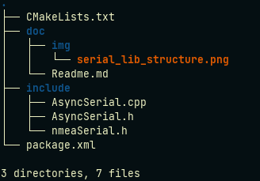

# serial_lib library

Asyncronous serial class used to comunicate with RS232 ports.
You have the specific class nmeaSerial for devices using nmea messages.

## Important Sources

AsyncSerial Library source[link](https://github.com/fedetft/serial-port/blob/master/3_async/AsyncSerial.h)

---

## How to use the library in a new package/node

#### CmakeLists.txt
Add library to find package 
```
find_package(catkin REQUIRED COMPONENTS
  roscpp
  serial_lib
)
```

#### package.xml
Add the following
```
<depend>serial_lib</depend>
```

#### Include the library in your new node

```
#include <nmeaSerial.h>
or 
# include<AsyncSerial.h>
```

#### Use in your code

In .h files: 
```
nmeaSerial serial_port_;
or 
AsyncSerial serial_port_;
```

In .cpp files:
```
serial_port_.some_method();
```
---

## Package Content



## Code documentation

[source](http://lungfish.isr.tecnico.ulisboa.pt/medusa_vx_doxy/medusa_addons/serial_lib_library/html/index.html)

